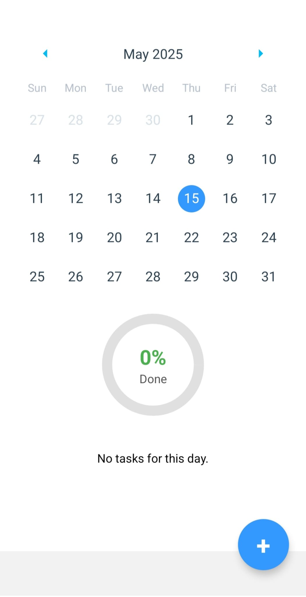
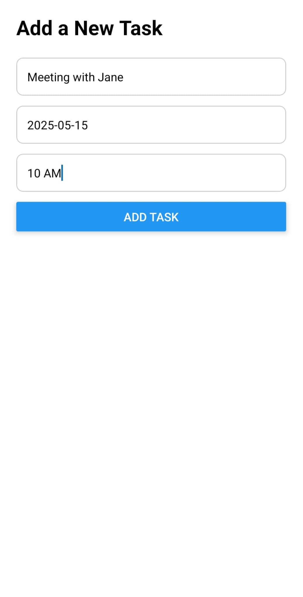
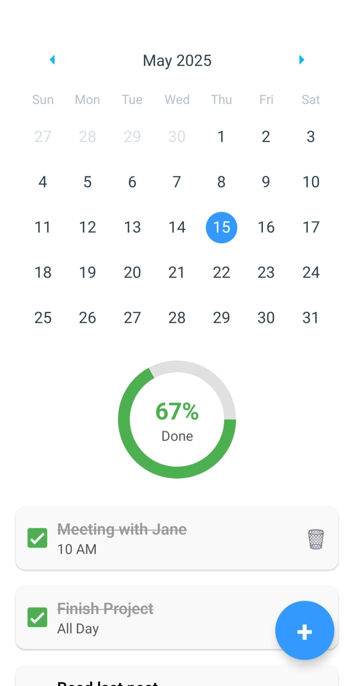
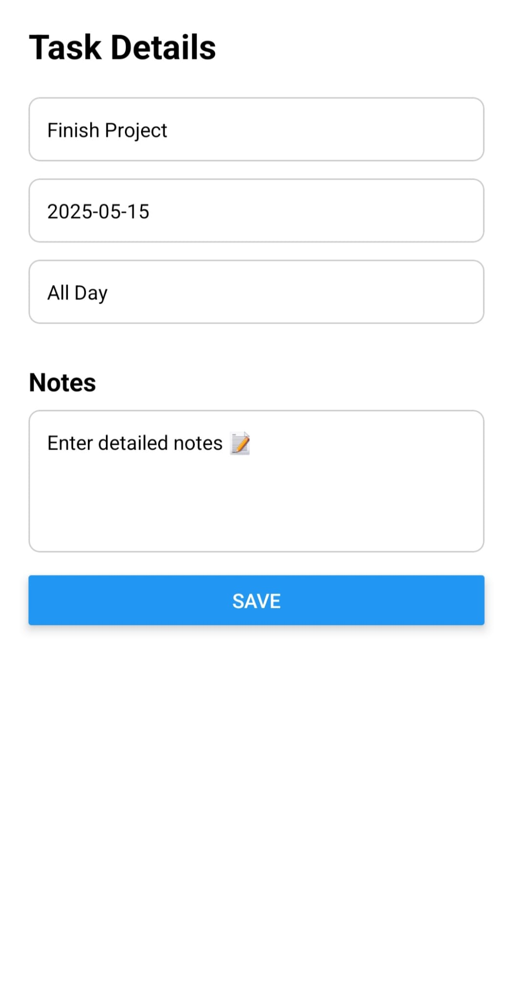

# ToDo App 🌞
This is a clean & simple to do list application built with **React Native**, **Expo**, and **TypeScript**

---

## Table of Contents

- [Features](#features)
- [Screenshots](#screenshots)
- [How to Try the App](#how-to-try-the-app)
  - [Android Devices](#android-devices)
  - [iOS Devices (via Expo Go)](#ios-devices-via-expo-go)
- [Updates](#updates)

---

## Features 

- Calendar to filter tasks by date
- Checkboxes to mark tasks as done
- Progress ring showing daily task completion
- Add or edit notes to each task by pressing on it
- Data stored with AsyncStorage, persists across sessions
- Add, edit, and delete tasks

## Screenshots
### 🟡 Home Screen 
Shows monthly calendar, current date already selected, and a progress ring for each day

---
### 🟠 Add a Task Screen
Users can create a new task pressing "+" button on the right bottom corner and by entering the title, date, and optionally the time.

---

### 🟢 Home Screen (With Tasks)
Tasks appear for the selected day with checkboxes on the left. The progress ring updates as tasks are marked complete.

---

### 🔵 Task Details & Notes
Edit a task's title, date, time, and add custom notes by pressing on the task. This is useful for reminders or additional task info.

---
## How to Try the App
🌟
Follow the steps below based on your device:

---

#### Android Devices
🤖📱

You can install the standalone APK build directly:

1. Open this link on your Android devices (or scan the QR code) then click Install:
[ToDo for Android](https://expo.dev/accounts/aysef/projects/todo-app/builds/53276e7a-92fa-4190-83ea-90ecb9ba8f93)

2. Click Download when prompted and open the file to install the app.
You may need to allow installations from unknown sources in your device settings.

#### iOS Devices (via Expo Go)
🍎📱

1. Download Expo Go from the App Store:
[Expo Go for iOS](https://apps.apple.com/us/app/expo-go/id982107779)

2. Open Expo Go and log in or sign up (an account is required)

3. Open this link in your browser on your phone (or scan the QR code). Your device will prompt to **open it in Expo Go**.
[ToDO for iOS](exp://u.expo.dev/05e99f8e-c05c-4dee-a981-dd995fc25f70?channel-name=preview&runtime-version=1.0.0&platform=ios)

---
### Updates

This app supports OTA (Over the Air) updates. Reopening the app in Expo Go will automatically load the latest version